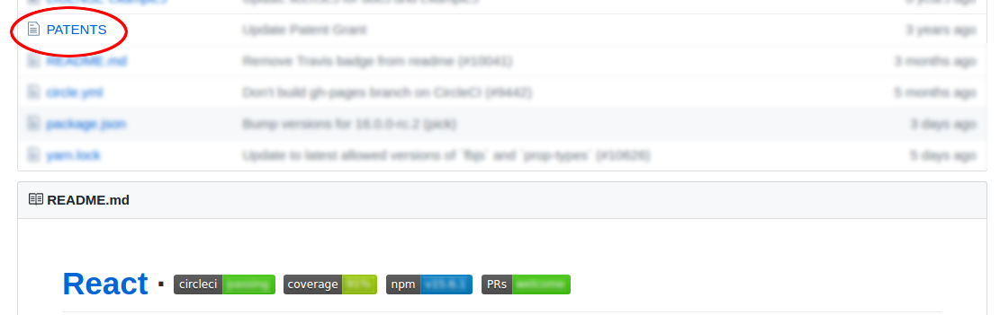
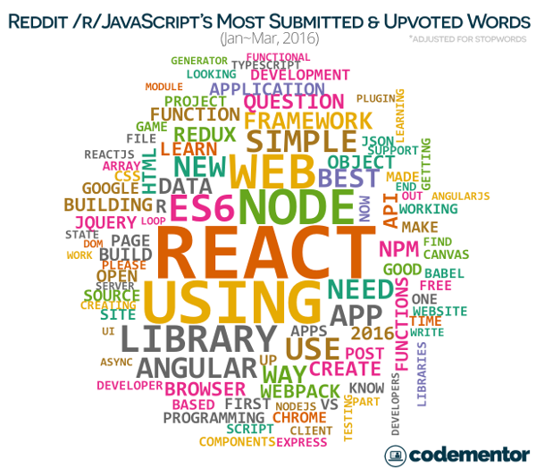

# Jak nadążyć za jsem?
## by Olgierd &#34;Allgreed&#34; Kasprowicz

# Disclaimer
<!-- .slide: data-background-color="black" -->

Note:
Kod na githubie
Moje opinie są moje, a nie mojego pracodawcy lub podmiotów, w których jestem udziałowcem.
Jak nie rozumiecie to krzyczcie
Podziękować Kitty, że jest tutaj ze mną

## Hackerspace
<!-- .slide: data-background-color="black" -->

Note:
Hackerspace to 4 rzeczy:
- Oszczędność czasu i hajsu
- Kultura wymiany wiedzy
- Community
- FLOSS

## Disclaimer: Facebook i kaluzula patentowa
<!-- .slide: data-background-color="black" -->

Note:
Obczajcie sobie na Githubie
Paczki niespoko od Fejsa: React, Jest, klient i serwer GraphQL
Paczki spoko od Fejsa: Yarn

## O czym nie będzie - ekosystem vs język

<!-- Tu skończyłem pozmieniać tytuły -->
## ???
JavaScript Jscript EcmaScript TypeScript CoffeScript LiveScript Mocha

### Krótka historia JSa
### Języki kompiloane do JSa
### Ecma International (też JSON, C#, C++)
### ECMA-262

## Jak śledzić JSa?

### RSS, Twitter, Blogi (wszystko chuj, bo jest zopiniowane)
### TC39
#### ??? (co to?)

#### Przykładowa specyfikacja
##### Z czego się składa?
##### Jak czytać
#### Miara gotowości specyfikacji (Stage 0 -> w języku)

#### Feedy (Twitter, Github -> RSS)

## Co nowego?

### Syntactic sugars (Array.prototype.include, exponential operator -> przykłady)

### Async / Await

#### ???
#### Callback vs Promise vs. Generator
#### Przykład (concurent i waterfall)

## Jak używac nowych rzeczy? (z kompatybilnością wsteczną)

### Babel (zaznaczyć licencję)
### Pokaz transpilacji (basic, coś bardziej zaawansowanego i async / await)
### Używanie niestandardowych wtyczek (es7/es8 -> coś fajnego)
### Pisanie własnego transpilatora (coś basic, ze stage'a 2, np. numeric literals, w Pythonie czy cuś)

## Bądź do przodu zanim inni będą! (Jak złozyć swój własny proposal kontrybucji do JSa)
<!-- TU skończyłem -->

## Pytanka? :)

## To podziękował