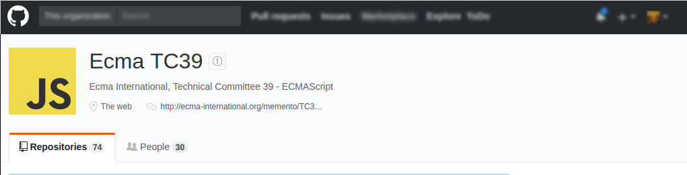
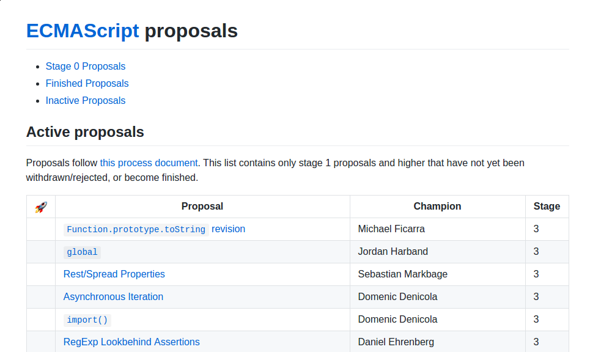
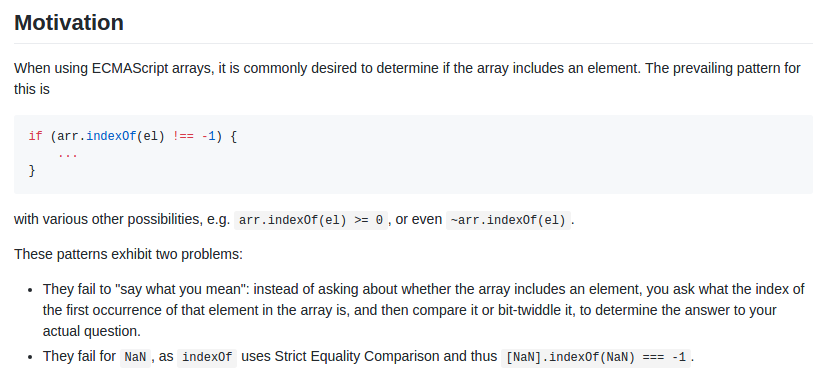
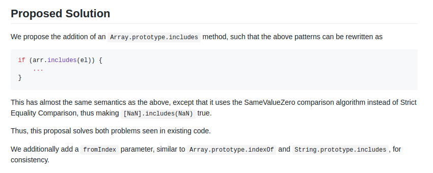
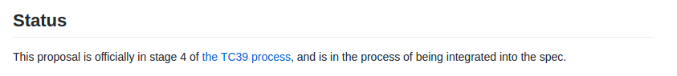

# Jak nadążyć za jsem?
## by Olgierd &#34;Allgreed&#34; Kasprowicz

Note:
- Techniczna: Dodatkowy monitor na notatki dopiąć [#nabogato] :DD
- Techniczna: Odpalić fullscreen przy pomocy F11, a nie "f"
- Techniczna: Ogarnąć mazak i gąbkę do tablicy

- Polecam zaciągnąć prezkę z Githuba [link na Meetupie] -> dużo linków w materiałach + kody demo do śledzeine na bieżąco
- To nie jest szkoła, jak nie rozumiecie to krzyczcie [test: "Importując tensor-flow wygenerujemy exploita Emacsem przez Sendmail"]
- Jaki poziom nadążania za JSem na sali? (AA / 3lvl: let+const | Promise'y, generatory | async+await+dekoratory)


# <span style="color: #b58900">Disclaimer</span>
<!-- .slide: data-background-color="black" -->

Note:
- Podziękować Kitty, że jest tutaj ze mną
- Moje opinie są moje, a nie mojego pracodawcy lub podmiotów, w których jestem udziałowcem / akcjonariuszem.
- Prezka jest w pełni open-source, na licencji MIT, zrobiona przy pomocy reveal.js [open-source] i GIMPa [też open-source]. Żaden Photoshop nie został spiracony podczas jej tworzenia.


<!-- .slide: data-background-color="black" -->


- Oszczędność czasu i hajsu
- Kultura wymiany wiedzy
- Community
- FLOSS

Note:
Jak się prezka spodoba i nie jesteście członkami to wrzućcie drobniaki, bo bardzo chcemy utrzymać to miejsce -> 5taka lub dychę


## <span style="color: #b58900">Disclaimer: Facebook i kaluzula patentowa</span>
<!-- .slide: data-background-color="black" -->


Note:
Obczajcie sobie na Githubie
Paczki niespoko od Fejsa: React, Jest, GraphQL
Paczki spoko od Fejsa: Yarn


## <span style="color: #b58900">O czym nie będzie</span>
<!-- .slide: data-background-color="black" -->


Note:
Ekosystem vs język. Nie będzie o paczkach i nie będzie o API przeglądarkowym / C++owym.


## <span style="color: #b58900">JS = FLOSS ?</span>
<!-- .slide: data-background-color="black" -->


Note:
TL:DR: Tak
Długa odpowiedź za chwilkę ^^


<h1 style="font-size:2.11em">???????</h1>

- TypeScript
- CoffeeScript
- Mocha
- LiveScript
- Jscript
- <span style="font-weight: bold; color: #b58900">JavaScript</span>
- ECMAScript
- ECMA-262
- ES6
- ES2015

Note:
Tyyyyyyyle dziwnych nazw, ktoś wie co one wszystkie znaczą? PS. Mocha to nie test runner ;)


## Języki kompilowane do JSa


### CoffeeScript


Note:
Pojawił się w 2009, licencja MIT, imo trochę wygląda jak Pytong xD


### TypeScript


Note:
Pojawił się w 2012, licencja Apache 2.0, good job Microsoft


- Mocha
- LiveScript
- Jscript
- <span style="font-weight: bold; color: #b58900">JavaScript</span>
- ECMAScript
- ECMA-262
- ES6
- ES2015


## Krótka historia JSa


### Mocha - Maj 95' (Netscape)

Note:
Oryginalna nazwa "Mocha" przez foundera Netscape'u


### LiveScript - Wrzesień 95' (Netscape)

Note:
Nie mogłem znaleźć powodu zmiany nazwy


### JavaScript - Grudzień 95' (Netscape)

Note:
Sun Microsystems dał licencję na trademark "Java". Java była wtedy popularna w chuj, więc chcieli zyskać na hypie marketingowym.


### Jscript - 96' (Microsoft)

Note:
Microsoft nie chciał się pchać w przepychanki trademarkowe. Prawo w Stanach jest pojebane w tym zakresie. W tym momencie jest to "wtyczka" do .NETa, nie przejmujcie się tym


- ECMAScript
- ECMA-262
- ES6
- ES2015
- <span style="font-weight: bold; color: #b58900">JavaScript</span>


##  ECMAScript - 97' (ECMA International)

European Computer Manufacturers Association

Note:
Netscape przekazał prace nad językiem. To nie są jakieś korpo-buce, tylko oddolna organizacja standaryzująca, współpracują też z rządowymi organizacjami standaryzującymi.Nazwę zmienili, bo nie chcą się bujać z Sunem odnośnie trademarków. Mieli też historie submitownaia i unsubmitowania propozycji standaryzacji Javy.


## ECMA-262 = ECMAScript

Note:
Nazwa kodowa ECMAScript
ECMA standaryzuje też C++ (372), C#(334) i JSONa(404) [Mem, bo na wikipedii nie ma tej strony xD].


## Krótka historia ECMAScript


### Pierwsze wydanie - Czerwiec 97'

Note: 1 wydanie, rok później. Kompatybliność z ISO.


### 3 - Czerwiec 98'

- RegExpy
- Try/Catch


### Niiiiiiiiiiiiiiiiiiiiiiiiiiiiiiiiic...


### 5 i 5.1 - Czerwiec 2009 / 2011

Note:
Troszku poprawione, kompatybilne z ISO


### Teraz
### ES6 = ES2015

Note:
No ogólnie zadziało się dużo, lista zmian w materiałach (m.in. inne deklarowanie zmiennych, template literals, Promises, module syntax [import/export]). Czy wszyscy to kojarzą +-? ECMA obiecała wypuszczać standard co roku i stąd numeracja (nie wersja standardu, a rok wypuszczenia).


- <span style="font-weight: bold; color: #b58900">JavaScript</span>


## <span style="color: #b58900">JavaScript</span> ???

- TL:DR -> JS = ES
- Długa odpowiedź

Note:
JS = (Implementacja ^ dialekt) ES + (BrowserAPI ^ C++ API)  
Język jest zbiorem reguł / standardem, więc implementacja to kompilator / interpreter (np. V8)  
Imo bardziej dialekt    
Oba terminy są używane.     


## Recap: JS = FLOSS ?

- ES -> Licencja BSD
- Zabezpieczone patenty

Note:
To temat był ruszony na początku -> specyfikacja jest na licencji BSD + ECMA ma fajną politykę odnośnie patentów (nie mogą one blokować potencjalnych implementacji). Link w materiałach.


# Jak nadążyć za ECMAScript?

Note:
Tak powinien brzmieć tytuł. Tylko wtedy nikt by nie przyszedł, bo nie wiedzałby o co chodzi ;)


## Twitter, Blogi, Meetupy, Nagrania z konfernecji, Książki...


Note:
- Odstęp czasowy między zmianą w proposalu, a publikacją artykułu (czas na zauważenie, przetworzenie [w tym jakieś zabawy z ficzerem], pisanie i publikację -> rozrysować na tablicy jak będzie opcja)
- Nie pokrywają wszystkiego (nie o wszystkich rzeczach ktoś chce pisać)
- Zopiniowane i okrojone (jakby nie były okrojone to można byłoby zreposotwać proposal)

- Ogólnie to wszystko jest fajne, tylko służy innym celom, niż śledzenie standardu


## TC39



Note:
Osoby bezpośrednio odpowiedzialne za standaryzację ES. Członkami są też firmy, m.in. Facebook, GoDaddy, Bloomberg, które wysyłają swoich ludzi. Spotykają się ~6 razy w roku i ogarniają ficzery.





## Przykładowy proposal

<a href="https://github.com/tc39/Array.prototype.includes" target="_blank">Array.prototype.include </a>

Note:
[Tab + Enter]
Lajtowy ficzer (niewiele dodatkowej syntaksy), używamy w Aidlabie na produkcji. Jak ktoś widział jedno README na Githubie to widział je wszystkie.


## Z czego się składa i jak czytać?

- Problem
- Rozwiązanie
- Status
- Dodatkowe info

Note:
- Czemu w ogóle ten prospoal powstał?
- Jak rozwiązuje opisany problem (włącznie z formalną specką i testami)?
- Jak idzie implementacja?

Nie zawsze w ten sposób, nie zawsze w widocznym miejscu, ale te informacje tam są.


### Problem



Note:
Kto kiedykolwiek napisał taki kod w JSie jak jest na slajdzie? Kto rozumie problem? Kto uważa, że to jest istotny problem (wtedy warto czytać dalej)? 


### Rozwiązanie



Note:
Kto uważa, że to jest spoko rozwiązanie? Kto będzie używał od dzisiaj?


### Status




## Stage ???

| # |   Stage   |    Jak używać    |
|:-:|:---------:|:----------------:|
| 0 |  Strawman |         -        |
| 1 |  Proposal |       Nope       |
| 2 |   Draft   | Eksperymentalnie |
| 3 | Candidate |      Uważnie     |
| 4 |  Finished |   Na produkcji   |

Note:
Ogólnie od Stage'a 3ciego te ficzery są praktycznie gotowe, natomiast polecam śledzić 3ci jeśli zależy nam na high avaiblity.


## Automatyzacja


```
    [Link do repo]/commits/master.atom
```
<a href="https://github.com/tc39/Array.prototype.includes/commits/master.atom" target="_blank"></a>

Note:
Wchodzenie codziennie na GH i porównywanie diffa nie brzmi legitymacyjnie. RSS to the rescue!

(Rich Site Summary). Automatyczne, konfigurowywalny news-feed => taka ściana na Facebooku tylko konfigurowywalna, z całego internetu i bez bullshitu

- Kto zna RSS?
- Kto używa RSS? Polecam ^^
- Można śledzić manifest (czyli zmianę statusu ficzerów) lub konkretne proposale.
- [Tab + Enter] Możecie tym nakarmić wasz ulubiony czytnik.
- Niby jest też Twitter TC39, ale wygląda na wymarły, link w materiałach


# ES2016

- Array.prototype.include
- Exponential operator \*\*

Note:
Szyyyyybki przegląd nowości od ES6


## Demo time!

Note:
Node + pokazać, że działa w przeglądarce
- const array = [1,1,2,3,5,8];
- array.includes(5);
- array.includes(6);
Można też ustalić początek wyszukiwania
- array.includes(2,1);
- array.includes(2,3);
I z minusem:
- array.includes(2,-2);
- array.includes(2,-5);

2 do potęgi 10; 5 do potęgi 3;


# ES2017 - Async / Await

Note:
To jest nowy fajny dzieciak na osiedlu.     
Piszesz synchronicznie asynchroniczny kod :D    
Jest też zalążek multi threadingu w JSie, ale nie o tym ten meetup i nie jest to unikalne dla JSa.      
Yup, używam na produkcji :D


## Ale osohozi???

### Prosty case (po kolei):
- Pobieramy nazwę usera
- Pobieramy drugi post tego usera
- Tłumaczymy na angielski (zewnętrzny serwis)

Note:
- Kto wie, że jest asynchroniczność?
- Kto kuma asynchroniczonść? (Bartek tłumaczył na warsztatach z Node'a, możecie zagadać do niego)

Po co to wgl? Przecież mamy callabcki, Promise'y i generatory...

Na prostym case'ie -> np. mamy bloga wielojęzycznego.

- Używamy boilerplate.js [objaśnić, pokazać szybko]
- W repo folder `code`


## Callback - demo time!


Note:
[cd code/async_await]   
[cp callback.js playground.js]  
[sub playground.js, ukryć drzewko plików]   
[odpalić równolegle terminal z node'em i resizować okno]    

- Callback hell -> w sumie nie zrobiliśmy nic skomplikowanego, a już jest troszku dramat
- Error handling (tutaj nie ma, chciałem, żeby funkcja mi się zmieściła na ekranie xd, natomiast jest to dramat)
- jsonPlaceholder -> fajna stronka do takich rzeczy
- Czy wszyscy znają: template literals, funkcje strzałkowe, dekonstrukcja?
- Tick i tock, żeby pokazać asynchroniczność


## Promise - demo time!!!

Note:
- Kto zna pojęcie Promise'a?
- Kto używa?
- Kto wie jak działają?
TL:DR Abstrakcja nad callbackami, oddziela asynchroniczną akcję od callbacku -> długa odpowiedź w materiałach     

`const { **promise**Request } = require('./boilerplate');`

- [split to functions -> printName, printPost, printTranslation]
- W przypadku callbacków taki zabieg nie jest zalecany, bo te funkcje są nietestowalne [coupling] i gubimy logikę kodu

```
function ...(params)
{
    return promiseRequest(url[after first /]).then(data =>
    {
       // do the handling
    })
}
```

- [Wklejam calle do funkcji do głównej funkcji, przerzucam error handler na dół]
- [Explicit return userID w printName()]
- [Wrzucam argumenty (userID, 3, "ad aspera per astra") i odpalam, pyka w różnej kolejności]
- [Chainuję z then i odpalam error handlera]
- [Dorzucam funkcje strzałkowe -> można sterować argumentami, wywalam redundantny return]


## GENERATORRRRRR - demo!

Note:

- Imo to jest troszku hack
- Czy jest na sali ktoś poza mną kto to ogarnia? Szanuję ;)
- [cp generator.js playground.js]

Wyjaśnienie TL:DR:

- Mamy funkcję pomocniczą, która iteruje po generatorze
- Następnie w ciele głównej funkcji tworzymy generator
- Przekazujemy do niego argumenty przez funkcję wyższego rzędu
- I to działa :D

...to jest ogólnie tough shit -> "metaprogramowanie" przez rekursję asynchroniczną...
- Nie będę się wgłębiał, bo nie o tym jest ta prezka (ale jakbyście chcieli to mogę zrobić meetupa o tym -> piszcie na Slacku)
- Ogólnie już jest naprawdę dobrze :D
...ale dalej mamy boilerplate + nie jest to trywialne...


## Async-await :D

Note:
- [Wywalam boilerplate generatorowy]
- [Wywalam try-catche]
- [Zamieniam yield na await]
- [Dopisuję async przed funkcją]

- Prawda, że prościej? 0 boilerplate'u -> ficzer języka :D
- Node wspiera to od 8, dlatego napisałem na Meetupie, że minimalnie 8.4 ;)
- GOOD JOB! Jesteś do ogarnięci na rok 2017 ^^


<!-- Tu skończyłem, pozmieniać tytuły -->
## Jak używac nowych rzeczy z kompatybilnością wsteczną?

### Babel (zaznaczyć licencję)
### Source to source compiler -> Transpiler
### Pokaz transpilacji (basic, coś bardziej zaawansowanego i async / await)
### Używanie niestandardowych wtyczek (es7/es8 -> coś fajnego)
### Pisanie własnego transpilatora (coś basic, ze stage'a 2, np. numeric literals, w Pythonie czy cuś)

## Pomaganie w tworzeniu specków

https://esdiscuss.org/topic/having-a-non-enumerable-array-prototype-contains-may-not-be-web-compatible
- Na liście dużo się dzieje, ale głównie noise. 
<!-- Kto to jest champion -->
<!-- Wypowiadają się championi, dobry case -->
<!-- To co było wcześniej to jest level tech lead, wszystko od teraz włącznie z tym jest powyżej i jest nadkozackie -->

## Bądź do przodu zanim inni będą! (Jak złozyć swój własny proposal kontrybucji do JSa)
<!-- Jak wygląda cały proces -->
<!-- TU skończyłem -->


# Pytanka? :)


# To podziękował

Note:
Przypomnieć nie-członkom, że drobne (5 / 10 PLN do puszki na HS) się przydadzą jak się podobała prezka
