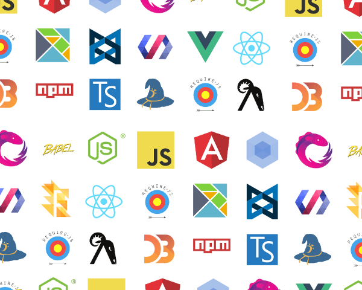
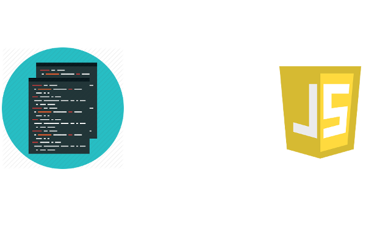
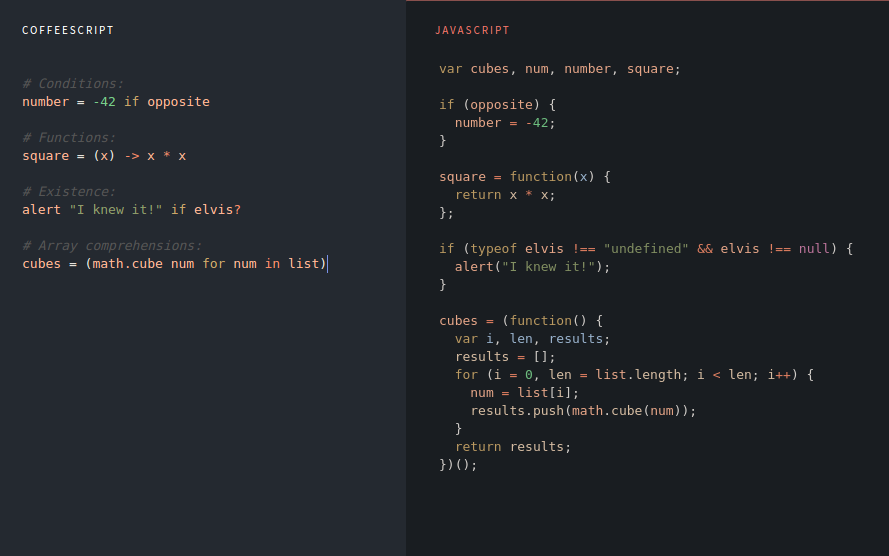
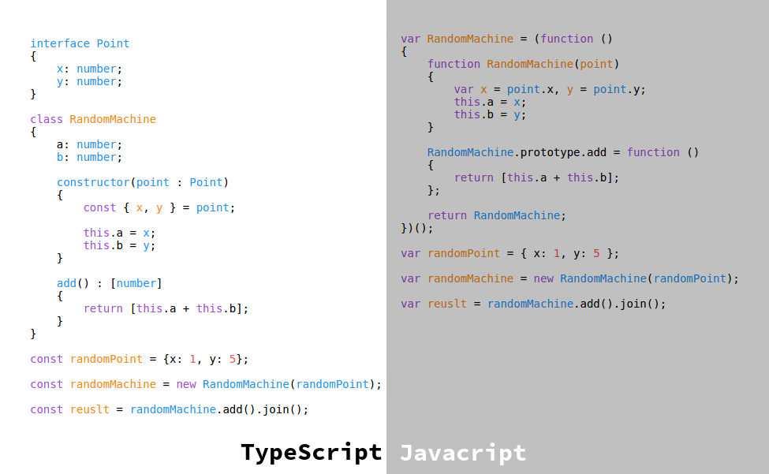

# Jak nadążyć za jsem?
## by Olgierd &#34;Allgreed&#34; Kasprowicz

# Disclaimer
<!-- .slide: data-background-color="black" -->

Note:
Kod na githubie, prezka zawiera duuuuużo linków, polecam obczaić ;)
Moje opinie są moje, a nie mojego pracodawcy lub podmiotów, w których jestem udziałowcem.
Jak nie rozumiecie to krzyczcie
Podziękować Kitty, że jest tutaj ze mną

<!-- .slide: data-background-color="black" -->

- Oszczędność czasu i hajsu
- Kultura wymiany wiedzy
- Community
- FLOSS

## Disclaimer: Facebook i kaluzula patentowa
<!-- .slide: data-background-color="black" -->

Note:
Obczajcie sobie na Githubie
Paczki niespoko od Fejsa: React, Jest, GraphQL
Paczki spoko od Fejsa: Yarn

## O czym nie będzie
<!-- .slide: data-background-color="black" -->

Note:
Ekosystem vs język. Nie będzie o paczkach i nie będzie o API przeglądarkowym / C++owym.

<h1 style="font-size:2.11em">???????</h1>

- TypeScript
- CoffeeScript
- Mocha
- LiveScript
- Jscript
- JavaScript
- ECMAScript
- ECMA-262
- ES6
- ES2015

Note:
Tyyyyyyyle dziwnych nazw, ktoś wie co one wszystkie znaczą? PS. Mocha to nie test runner ;)

## Języki kompilowane do JSa

### CoffeeScript

Note:
Pojawił się w 2009, licencja MIT, imo trochę wygląda jak Pytong xD

### TypeScript

Note:
Pojawił się w 2012, licencja Apache 2.0, good job Microsoft

- Mocha
- LiveScript
- Jscript
- JavaScript
- ECMAScript
- ECMA-262
- ES6
- ES2015

## Krótka historia JSa

### Mocha - Maj 95' (Netscape)

Note:
Oryginalna nazwa "Mocha" przez foundera Netscape'u

### LiveScript - Wrzesień 95' (Netscape)

Note:
Nie mogłem znaleźć powodu zmiany nazwy

### JavaScript - Grudzień 95' (Netscape)

Note:
Sun Microsystems dał licencję na trademark "Java". Java była wtedy popularna w chuj, więc chcieli zyskać na hypie marketingowym.

### Jscript - 96' (Microsoft)

Note:
Microsoft nie chciał się pchać w przepychanki trademarkowe. Prawo w Stanach jest pojebane w tym zakresie. W tym momencie jest to "wtyczka" do .NETa, nie przejmujcie się tym

- ECMAScript
- ECMA-262
- ES6
- ES2015
- JavaScript

## ECMA International - ECMAScript (od 97')

European Computer Manufacturers Association

Note:
To nie są jakieś korpo-buce, tylko oddolna organizacja standaryzująca, współpracują też z rządowymi organizacjami standaryzującymi. Netscape przekazał prace nad językiem. Nazwę zmienili, bo nie chcą się bujać z Sunem odnośnie trademarków. Mieli też historie submitownaia i unsubmitowania propozycji standaryzacji Javy.

## ECMA-262 = ECMAScript

Note:
Nazwa kodowa ECMAScript
ECMA standaryzuje też C++ (372), C#(334) i JSONa(404) [Mem, bo na wikipedii nie ma tej strony xD].

## Krótka historia ECMAScript

### Pierwsze wydanie - Czerwiec 97'

Note: 1 wydanie, rok później. Kompatybliność z ISO.

### 3 - Czerwiec 98'

- RegExpy
- Try/Catch

### Niiiiiiiiiiiiiiiiiiiiiiiiiiiiiiiiic...

### 5 i 5.1 - Czerwiec 2009 / 2011

Note:
Troszku poprawione, kompatybilne z ISO

### Teraz
### ES6 = ES2015

Note:
No ogólnie zadziało się dużo, lista zmian w materiałach (m.in. inne deklarowanie zmiennych, template literals, Promises, module syntax [import/export]). Czy wszyscy to kojarzą +-? ECMA obiecała wypuszczać standard co roku i stąd numeracja (nie wersja standardu, a rok wypuszczenia).

- JavaScript

## JavaScript ???

- TL:DR -> JS = ES
- Długa odpowiedź

Note:
JS = (Implementacja ^ dialekt) ES + (BrowserAPI ^ C++ API)  
Język jest zbiorem reguł / standardem, więc implementacja to kompilator / interpreter (np. V8)  
Imo bardziej dialekt    
Oba terminy są używane.     

# Jak nadążyć za ECMAScript?

Note:
Tak powinien brzmieć tytuł. Tylko wtedy nikt by nie przyszedł, bo nie wiedzałby o co chodzi ;)

## RSS, Twitter, Blogi 

Note:
- Zopiniowane
- Nie zawsze na bieżąco
- Nie zawsze uwzględniają wszystkie aspekty nowego ficzera

## Ecma Technical Committee 39 (TC39)

Note:
Osoby bezpośrednio odpowiedzialne za standaryzację ES. Członkami są firmy, m.in. Facebook, GoDaddy, Bloomberg, które wysyłają swoich ludzi. Spotykają się kilka razy w roku i ogarniają ficzery.
<!-- Tu skończyłem, pozmieniać tytuły -->

<!-- Strona na githubie, jako wyjaśnienie jak ogarniać co robią te typy -->

#### Przykładowa specyfikacja
##### Z czego się składa?
##### Jak czytać
#### Miara gotowości specyfikacji (Stage 0 -> w języku)

#### Feedy (Twitter, Github -> RSS)

## Co nowego?

### Syntactic sugars (Array.prototype.include, exponential operator -> przykłady)

### Async / Await

#### ???
#### Callback vs Promise vs. Generator
#### Przykład (concurent i waterfall)

## Jak używac nowych rzeczy? (z kompatybilnością wsteczną)

### Babel (zaznaczyć licencję)
### Pokaz transpilacji (basic, coś bardziej zaawansowanego i async / await)
### Używanie niestandardowych wtyczek (es7/es8 -> coś fajnego)
### Pisanie własnego transpilatora (coś basic, ze stage'a 2, np. numeric literals, w Pythonie czy cuś)

## Bądź do przodu zanim inni będą! (Jak złozyć swój własny proposal kontrybucji do JSa)
<!-- TU skończyłem -->

# Pytanka? :)

# To podziękował